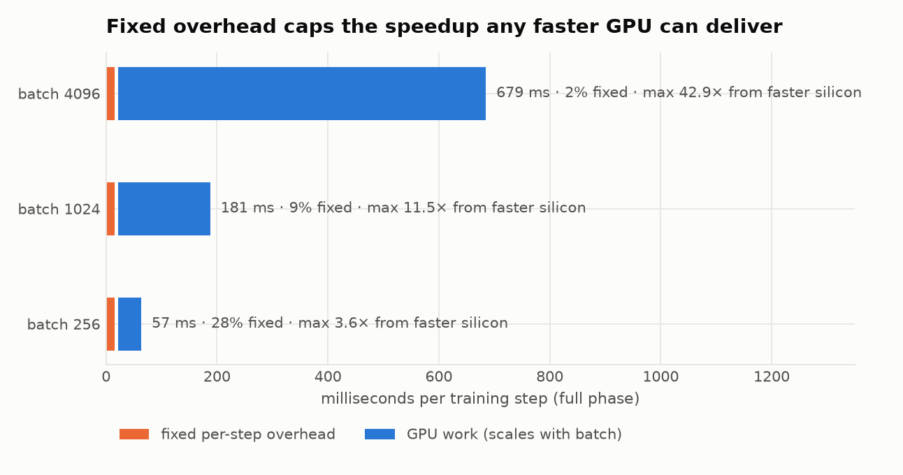
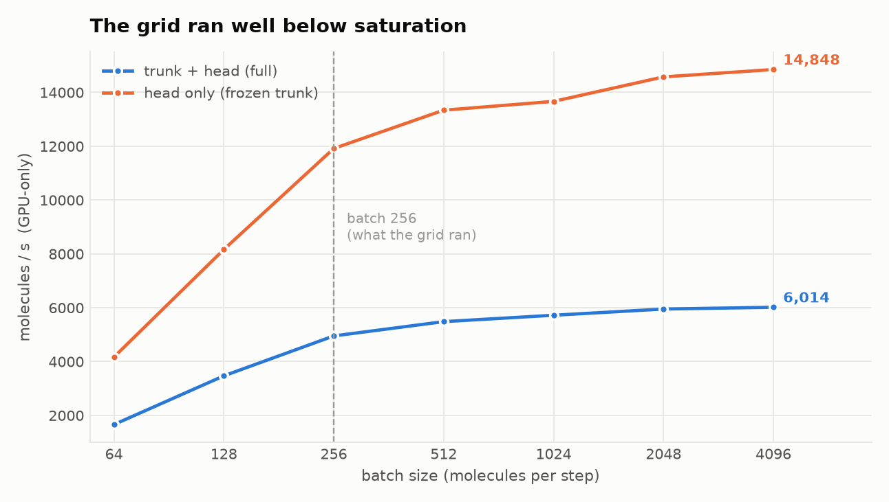
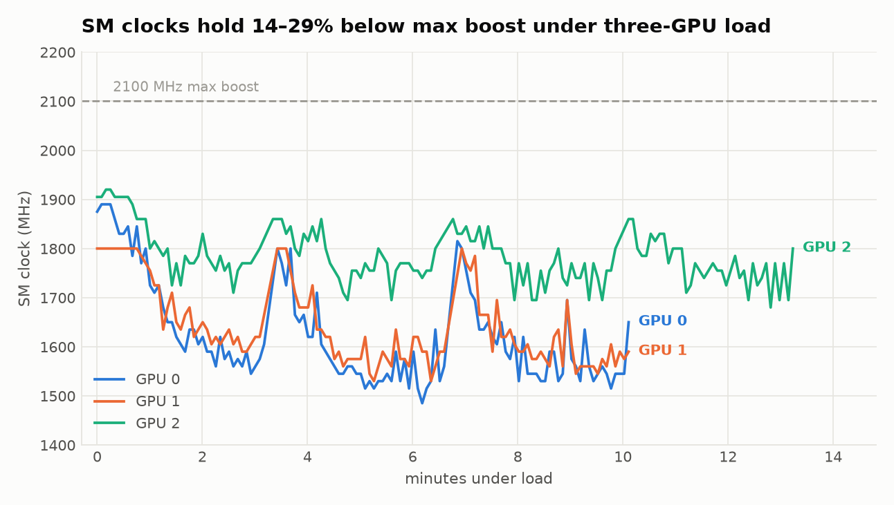
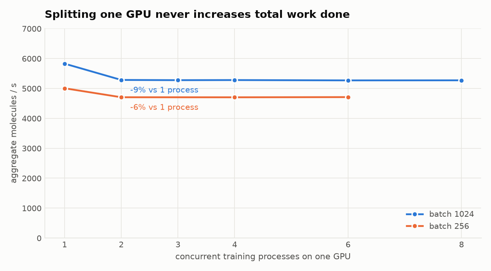
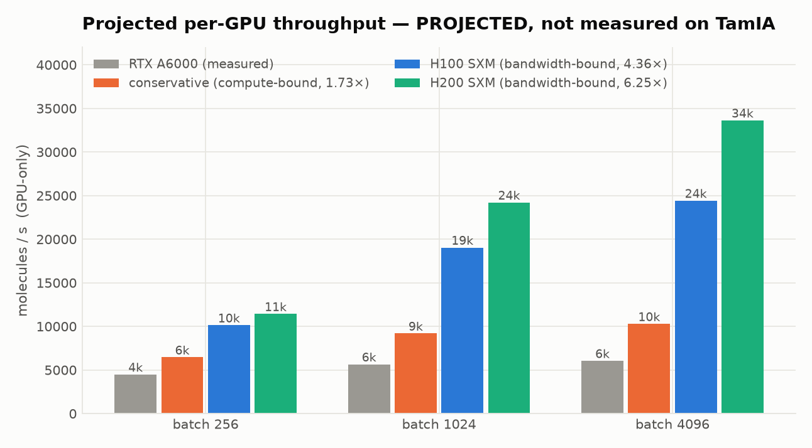

# Computational profile of full-trunk MiniMol fine-tuning

**What this costs today, what actually limits it, and what TamIA would buy.**

Measured 2026-08-11 on `rabelais-1` (3× RTX A6000 48 GB, sm_86; 124 CPUs, 460 GB RAM).
Every number traces to `reports/benchmark.json`, `reports/grid_summary.json`,
`reports/grid_timings.csv`, `reports/concurrency*.json`, or `reports/gpu_telemetry.csv`.

**Provenance of the TamIA figures**, since they carry the most weight and the least evidence:

| claim | status |
|---|---|
| node counts, partitions, time limits | **verified** — `sinfo` from `tamia2`, supplied 2026-08-11 |
| whole-node allocation, all 4 GPUs, job-duration policy | Alliance documentation (secondary) |
| per-GPU throughput on H100/H200 | **projected** — derived in §5, never measured |
| your allocation share, queue wait | **unknown** |

Nothing has been executed on TamIA. Any speed figure attributed to it is a projection.

---

## Summary

| | |
|---|---|
| One run (4 epochs, 331k molecules, 5-fold CV split) | **3.3 min**, 1.5 GB GPU, 34 MB checkpoint |
| The 10-run grid (5 folds × 2 seeds) | **13 min wall**, 0.54 GPU-hours |
| What limits it at batch 256 | **~28% fixed per-step overhead** — not compute, not memory |
| Ceiling on any GPU upgrade at batch 256 | **3.6×**, no matter how fast the silicon |
| Projected per-GPU gain on H100/H200 | **1.4–2.6×** at batch 256; **1.7–5.6×** at batch 4096 |
| Splitting one GPU across runs | **never helps** — 0.90–0.94× of a single process |
| Realistic TamIA gain on a 250-trial Bayesian sweep | **4–8×** (18 h → 2.3–4.5 h), bounded by the sweep, not the cluster |
| The thing actually blocking TamIA | **`wandb agent` needs internet; compute nodes have none** |

The 3.6× ceiling and the 2.6× projection are consistent, not contradictory: the ceiling
assumes an *infinitely* fast GPU, which only removes the 72% of the step that is variable.
The H200's projected 6.25× on that portion already captures most of the available headroom —
which is precisely why more silicon is the wrong lever at this batch size.
| Projected grid wall-clock on TamIA | **~1.4 min** (12 GPUs, one wave) |

**The headline is not the hardware.** At the batch size we currently train with, roughly a
third of every step is fixed overhead that faster silicon does not touch. Raising the batch
size costs nothing and lifts the ceiling on any hardware upgrade from 3.6× to 43×. Do that
first; it is free, and it is worth more than the GPU generation gap at this batch size.

**TamIA is worth moving to, but for a smaller and more specific reason than it first appears.**
The cluster has ~260 GPUs against your 3 — yet a Bayesian sweep cannot use more than ~8–16
trials in parallel before it stops being Bayesian, so the realistic gain is **4–8×**, not 80×.
And the thing actually preventing the move is not compute at all: **`wandb agent` requires
internet and TamIA's compute nodes have none.** Fix that first or the hardware is moot.

### Recommended order

1. **Replace the sweep mechanism** — Optuna with filesystem storage; this is the gating item.
2. **Move to batch ~1024 and 16 dataloader workers**, and re-tune the learning rate. Worth more
   than the hardware change (3.4× vs 2.3× per-GPU gain on H100).
3. **Keep `rabelais` for development** — zero queue wait and a 13-minute grid beat any shared
   cluster for iteration.
4. **Request 1–2 nodes on `gpubase_bynode_b2` (12 h)** for the sweep; bundle many trials per
   job, 4 concurrent — one per GPU, never split.

---

## 1. What one run costs

10 runs × 4 epochs (2 frozen, 2 full), batch 256, 4 dataloader workers. Steady-state medians,
with the first epoch of each phase excluded (see the warm-up column):

| phase | epoch | train | val | warm-up overhead | peak GPU | throughput |
|---|---|---|---|---|---|---|
| head only (trunk frozen) | 32.0 s | 26.1 s | 6.1 s | +3.3% | **0.16 GB** | 10,178 mol/s |
| trunk + head (full) | 65.7 s | 59.4 s | 6.2 s | −0.7% | **1.52 GB** | 4,462 mol/s |

Three things worth reading off this table:

- **Freezing the trunk is 2.05× faster per epoch and uses 9.5× less memory.** Not because the
  backward pass is skipped alone — with no trunk parameter requiring grad, autograd builds no
  graph through the trunk at all, so the intermediate activations are never stored.
- **Warm-up is negligible** (+3.3% on the first frozen epoch, and nothing measurable on the
  first full epoch). Worth measuring rather than assuming, since with 2 epochs per phase it
  would otherwise be half the sample.
- **Validation is 9% of an epoch** and forward-only, so it scales differently from training.

Run-to-run spread across the whole grid was **57.6–60.4 s** for the steady full epoch (4.9%),
including whatever GPU each job landed on.

---

## 2. Where the time goes

`reports/benchmark.json`, batch 256, GPU-only (batch pre-collated and resident, so no CPU
work inside the timed region):

| | frozen | full |
|---|---|---|
| step time | 21.3 ms | 51.2 ms |
| throughput | 12,024 mol/s | 4,999 mol/s |
| **kernel launches per step** | **1,730** | **4,487** |

Four and a half thousand kernel launches to process 256 molecules. That is the signature of
many tiny operations rather than a few large ones, which is exactly what a GNN over graphs
averaging ~25 nodes produces.

### The cross-check that validates the whole model

The GPU-only step time predicts the grid's observed end-to-end epoch to **+11%**
(53.6 s predicted vs 59.4 s observed). That gap is the CPU pipeline not perfectly overlapping
the GPU, and it is the expected direction and magnitude. The benchmark and the real runs are
measuring the same thing.

---

## 3. What actually limits it

Step time is almost perfectly linear in batch size — **R² = 0.999** for both phases:

```
full    step_ms = 15.8 + 0.1618 × batch
frozen  step_ms =  7.2 + 0.0655 × batch
```

The intercept is per-step cost that **does not shrink with batch size**: kernel launch, CUDA
sync, and Python dispatch. Faster silicon does not remove it.



| batch | step time | fixed share | **ceiling on any GPU upgrade** |
|---|---|---|---|
| 256 (what the grid ran) | 57 ms | 28% | **3.6×** |
| 1024 | 181 ms | 9% | 11.5× |
| 4096 | 679 ms | 2% | 43× |



Three independent measurements agree that this workload is **not** compute-bound:

- **bf16 made it 8% slower**, not faster (52.7 ms fp32 → 57.1 ms bf16). Autocast overhead
  exceeds any tensor-core gain when the kernels are this small. TF32 did help, +16%, so there
  *is* a matmul component — but a modest one.
- **Memory is nowhere near a limit.** Batch 4096 in the full phase peaks at **21.8 GB** of 48;
  the grid's batch 256 used **1.5 GB**.
- **Throughput saturates by batch ~2048** (5,949 → 6,014 mol/s to 4096, a 1% gain), while
  memory would allow far larger.

### Achieved ceilings on this GPU

Measured with microbenchmarks on the same card, so the projection can be
achieved-to-achieved rather than against vendor peaks no real kernel reaches:

| | measured | vendor peak | efficiency |
|---|---|---|---|
| GEMM fp32 | 22.7 TFLOP/s | 38.7 | 59% |
| GEMM TF32 | 58.0 TFLOP/s | — | — |
| GEMM bf16 | 105.9 TFLOP/s | — | — |
| Memory bandwidth | **687 GB/s** | 768 | **89%** |

### The CPU pipeline is not the bottleneck — yet

| workers | throughput (CPU only) | ms/batch |
|---|---|---|
| 0 | 6,074 mol/s | 42.1 |
| **4 (current)** | **28,579 mol/s** | 9.0 |
| 8 | 57,694 mol/s | 4.4 |
| 16 | 149,501 mol/s | 1.7 |
| 32 | 190,912 mol/s | 1.3 |

At 4 workers the pipeline delivers 28,579 mol/s against a GPU consuming 4,999 — invisible
today. But a 5× faster GPU would consume ~25,000 mol/s and the CPU would become the limit.
**On faster hardware, raise `--num-workers` to 16.** This box has 124 cores; the headroom is
already there.

### Sustained load: power- and thermally-capped, but the trend is an open question



Under three-GPU load the cards ran at **1,500–1,800 MHz against a 2,100 MHz max boost** —
14–29% down — at **84–88 °C** and **260–287 W of a 300 W limit**. The
`clocks_event_reasons` field asserted `0x4` (SW power cap) and `0x20` (SW thermal slowdown),
frequently together as `0x24`. So the throttling is real and identified, not inferred.

**What this does not show is a trend.** The sawtooth in the chart is the four job waves — the
recoveries at ~3.5 and ~7 minutes are the idle gaps between them — so a linear slope fitted
over this 13-minute window is confounded by the scheduling pattern, not evidence of thermal
decay. A naive fit gives −6 to −18 MHz/min; **that number should not be used.** Settling it
needs a single sustained run of an hour or more with the sampler attached. It is listed as
open in §6 and deliberately kept out of the projection.

One attribution test came back **inconclusive**: SLURM remaps `CUDA_VISIBLE_DEVICES` to `0`
for every job, so run timings cannot be matched to physical GPUs. The 12% clock spread
between GPU 2 and GPU 0/1 against only a 4.9% spread in run times is *suggestive* that clock
differences pass through weakly — consistent with the fixed-overhead finding — but it is not
a controlled comparison and is not relied on.

---

## 4. Levers on current hardware, in order of value

| lever | effect | cost |
|---|---|---|
| **batch 256 → 1024** | +26% throughput; lifts the upgrade ceiling 3.6× → 11.5× | changes optimisation — see caveat |
| **TF32 on** | +16% | negligible numerical risk for this task |
| workers 4 → 16 | nothing today; required if the GPU gets faster | free, 124 cores available |
| bf16 autocast | **−8%** — do not use on Ampere here | — |

**Caveat on batch size, and it is not a small one.** Larger batches are a free *compute* win
and not a free *training* change: at batch 1024 an epoch has a quarter as many optimiser
steps, which generally needs the learning rate re-tuned. Treat the batch increase as a change
requiring a re-run of the schedule comparison, not a drop-in.

---

## 4.5 Should you split a GPU across concurrent runs?

`rabelais` permits splitting one GPU across concurrent jobs (`--gres=mps:N`) at the cost of the
other two. TamIA's whole-node rule raises the same question. Measured directly — N identical
processes pinned to one GPU with a synchronised start, timing the real training step on a
device-resident batch:



| processes | batch 256 | batch 1024 |
|---|---|---|
| 1 | **5,006 mol/s** | **5,829 mol/s** |
| 2 | 4,705 (0.94×) | 5,284 (0.91×) |
| 4 | 4,704 (0.94×) | 5,280 (0.91×) |
| 6 | 4,710 (0.94×) | 5,269 (0.90×) |
| 8 | — | 5,271 (0.90×) |

**Aggregate throughput never rises above a single process**, at either batch size. It drops
6–9% on the second process and then stays flat. Splitting buys nothing and costs ~9%.

Memory would have permitted 8 concurrent processes at batch 1024 (47.4 GB of 49 GB). **Sizing
this by memory alone would have suggested 8 splits and lost a third of the throughput** — the
error this measurement exists to prevent.

Because splitting costs the other two GPUs, the ranking is unambiguous:

| strategy | aggregate |
|---|---|
| split 1 GPU N ways | ~5,280 mol/s |
| 1 whole GPU, 1 run | 5,829 mol/s |
| **3 whole GPUs, 3 concurrent runs** | **~17,500 mol/s** |

**A prediction this refuted.** Before measuring, the expectation was that batch 256 *would* gain
from splitting, since 28% of its step is fixed overhead and concurrent processes should fill the
idle gaps. It did not. The reason the reasoning failed: **with no MPS daemon, processes
time-slice** — one CUDA context runs at a time — so idle gaps structurally cannot be filled
regardless of how much idle exists. This measurement therefore **cannot distinguish "the GPU is
saturated" from "time-slicing prevents overlap."** Under a real MPS daemon (`--gres=mps:N`, which
starts one) kernels from different processes can genuinely overlap and the answer may differ.
That is a separate, untested case.

---

## 5. What TamIA would buy

The projection scales each part of the step by the ratio appropriate to it:

- **fixed 15.8 ms/step → ×1.** Launch and dispatch overhead is host-side; a faster GPU does
  not remove it.
- **variable 0.1618 ms/molecule → ×R**, where R is bounded on both sides:
  - **conservative R = 1.73** — if the variable part is compute-bound, scaling with fp32
    throughput (67 vs 38.7 TFLOP/s peak).
  - **optimistic R = 4.36 (H100) / 6.25 (H200)** — if bandwidth-bound, scaling achieved
    687 GB/s against 3.35 / 4.8 TB/s at the same 89% efficiency.

  The evidence points nearer the bandwidth end (bf16 slower, thousands of tiny kernels), but
  TF32's +16% shows a real compute component, so the honest answer is a range.



| batch | A6000 (measured) | conservative | H100 | H200 |
|---|---|---|---|---|
| 256 | 4,474 mol/s | 6,441 (1.4×) | 10,119 (2.3×) | 11,415 (2.6×) |
| 1024 | 5,642 | 9,178 (1.6×) | 19,033 (3.4×) | 24,203 (4.3×) |
| 4096 | 6,037 | 10,269 (1.7×) | 24,410 (4.0×) | 33,619 (5.6×) |

### Two arguments for TamIA that the measurements do not support

- **"The H200's 141 GB unlocks much bigger batches."** It does not. The workload peaks at
  **1.5 GB** at the batch we train with and **21.8 GB** at batch 4096 — on a 48 GB card that
  is already not full. Throughput saturates long before memory does. The H200's headline spec
  is its least relevant one here.
- **"NVLink will speed this up."** Conditional, and the condition is under your control.
  Independent single-GPU runs exchange nothing — no gradient all-reduce, no model sharding — so
  NVLink is irrelevant to them. But TamIA requires a job to use **all 4 GPUs on its node**, which
  forces a choice: pack 4 independent runs one-per-GPU (NVLink stays irrelevant, and this is what
  the concurrency measurements in §4.5 recommend), or data-parallel a single run across 4 GPUs
  (NVLink then matters). Pick the former.

### The argument that does hold: device count — but bounded by the sweep, not the cluster

**Correction (2026-08-11).** An earlier version of this report claimed TamIA offered "12 GPUs,
one wave". That was wrong. It came from arithmetic on a remembered hardware description
(8× H200 + 4× H100), which describes node types, not available capacity. Real `sinfo` output
from `tamia2` replaces it:

| | |
|---|---|
| `gpubase_bynode_b1` | **65 GPU nodes** (44 mix, 15 alloc, 1 comp, 1 mix, 4 down/draining) |
| GPUs | **~260 at 4/node**, ~244 not down — roughly **80× rabelais** |
| Allocation | **whole nodes**; a job must use **all 4 GPUs** on every node it gets |
| Time limits | `b1` 3 h · `b2` 12 h · `b3` 24 h · `interac` 6 h |
| Job duration | ≥1 h expected (5 min for test jobs), ≤24 h |

So the cluster is far larger than claimed. **The binding constraint is not the hardware.**

#### A Bayesian sweep cannot use 260 GPUs

Bayesian optimisation is sequential by construction: its whole advantage over random search is
choosing each trial conditioned on completed ones. Run *k* trials concurrently and all *k* are
selected from the same stale posterior. Past roughly 8–16 parallel trials it degenerates
toward random search with extra machinery.

The realistic allocation is therefore **1–2 nodes (4–8 GPUs)**, and the honest comparison is:

| 250-trial sweep, 20 epochs, batch 1024 | wall clock |
|---|---|
| rabelais, 3× A6000 | **~18 h** |
| TamIA, 1 node (4 GPUs) | **~4.5 h** + queue |
| TamIA, 2 nodes (8 GPUs) | **~2.3 h** + queue |

A real **4–8×** — from parallelism plus a ~3.4× per-GPU gain at batch 1024 — not the 80× the
device count suggests. Queue wait is unmeasured and additive; most nodes were busy in the
sample above.

#### The actual blocker is not compute

**A wandb sweep cannot run on TamIA as currently designed.** `python -m wandb agent`
(the mechanism in CLAUDE.md) must reach the wandb server to fetch each next configuration, and
TamIA's compute nodes have no internet. This gates the entire sweep regardless of hardware.

The fix is an optimiser whose controller lives on the shared filesystem — Optuna with
SQLite/PostgreSQL storage gives TPE (Bayesian) and runs fully offline, with `WANDB_MODE=offline`
for logging and a `wandb sync` from a login node afterwards.

#### Consequences for job shape

- The 10-run grid as built here — 10 single-GPU array tasks of 3.3 min each — **does not map to
  TamIA at all**: whole-node allocation, all 4 GPUs used, ≥1 h jobs. Bundle many trials into
  one long job, 4 concurrent (one per GPU), cycling sequentially within each.
- At ~4 min per 20-epoch run on H100, one 12-hour `b2` job with 4 GPUs covers ~700 trials.

#### Still unknown

Your actual allocation (`sinfo` shows the whole partition, not your share), and queue wait.
Both bear directly on the numbers above.

---

## 6. Open questions

1. **Sustained-load throttling.** Confirmed present (power cap + thermal slowdown asserted,
   clocks 14–29% below boost) but its *trajectory* is unmeasured — 13 minutes of sawtooth
   load cannot separate decay from scheduling. Needs one sustained run of ≥1 hour with
   `scripts/sample_gpu.sh` attached. Excluded from the projection above.
2. **Where in the 1.73×–6.25× range the variable part really sits.** Settling it needs a
   memory-throughput profile of the actual GNN kernels (Nsight Compute), not just the
   microbenchmark bounds used here.
3. **Whether TamIA behaves as projected.** `src/benchmark.py` is self-contained and runs
   unchanged there; a single execution replaces this entire section with measurements.
4. **Whether MPS changes the splitting answer.** §4.5 measured time-slicing, where overlap is
   structurally impossible. `--gres=mps:N` on rabelais starts a real MPS daemon and would settle
   whether concurrent processes can genuinely share the GPU. The recommendation (never split)
   holds either way for *rabelais*, since splitting costs the other two GPUs regardless.
5. **Your TamIA allocation and its queue wait.** `sinfo` shows the whole partition, not your
   share. Both feed directly into the 4–8× figure.

## Reproducing

```bash
# Sampler first, wrapped in `timeout` -- nvidia-smi -l never exits on its own, and an
# orphaned sampler would keep appending to the CSV through later runs.
timeout 2400 scripts/sample_gpu.sh reports/gpu_telemetry.csv 5 &

sbatch scripts/run_grid.sbatch                 # 10 runs, ~13 min wall
# wait for the array to drain:  squeue -u $USER -n minimol_grid
pkill -f "nvidia-smi --query-gpu=timestamp"    # stop the sampler once the grid is done

python src/collect_runs.py                     # -> grid_summary.json, grid_timings.csv
python src/benchmark.py                        # ON AN IDLE GPU, ~1 min
python src/report_charts.py                    # -> the figures above
```

`src/benchmark.py` refuses to start if another process is resident on the GPU: every timing
here would otherwise be a measurement of contention. It also keeps `gpu_only`, `cpu_only` and
`e2e` timings strictly separate and labels each — conflating them is how a compute report ends
up recommending the wrong hardware.
